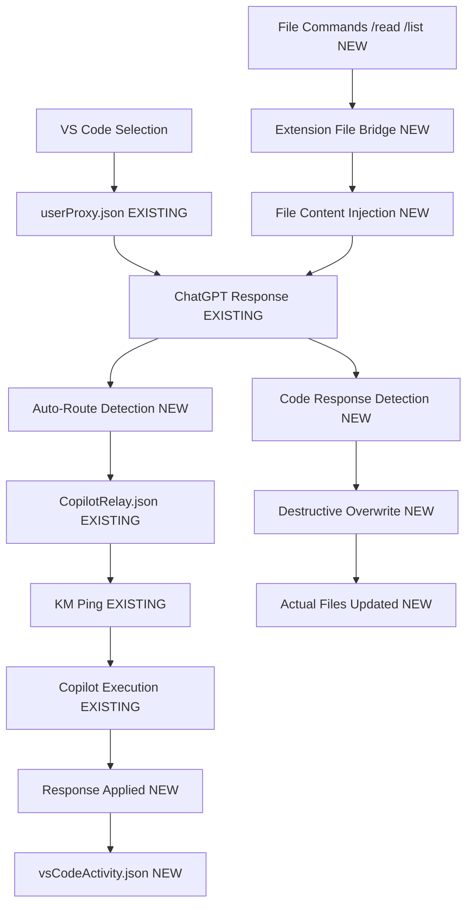

# 🔗 VS Code Extension - Mirror Native Mac App Interface

## Refined Approach: Extension + Existing Infrastructure

### 🎯 Core Concept

- **VS Code Extension** that mirrors your native Mac app interface
- **Reads same JSON files** as your Mac app (no new protocols)
- **Automates existing GPT→Copilot routing** you do manually
- **Destructive overwrite transmission** ("erase and replace from below this line")
- **Copies user proxy design** you already have working

---

## Phase 1: Extension Foundation

### 🪟 Chat Interface (mirrors native Mac app)

```typescript
// VS Code Extension WebView Panel
- Embedded chat interface reading from existing JSON files
- Same UI layout as your native Mac app
- Real-time updates via file watching (like your current system)
- Agent tabs: 🧠 ChatGPT, 🤖 Cursor, 🛠️ Copilot
```

### 📁 File System Integration (existing files)

```javascript
// Extension reads from your current files:
-relay_data / userProxy.json - // User messages (existing)
  relay_data / ChatGPTRelay.json - // ChatGPT responses (existing)
  relay_data / CopilotRelay.json - // Copilot responses (existing)
  relay_data / CursorRelay.json - // Cursor responses (existing)
  // New file for VS Code specific context:
  relay_data / vsCodeContext.json; // Code selections + file paths
```

---

## Phase 2: Automated GPT→Copilot Routing

### 🔄 Message Bridge (automates your manual process)

````javascript
// Copy your existing user proxy pattern:

// 1. GPT writes to ChatGPTRelay.json (existing)
// 2. Extension detects new ChatGPT message
// 3. If message contains code instruction:
//    - Extract instruction + code context
//    - Write to CopilotRelay.json (routing automation)
//    - Trigger KM script to ping Copilot

// Example routing logic:
if (
  chatGPTMessage.includes("// ROUTE_TO_COPILOT") ||
  chatGPTMessage.includes("```")
) {
  // Auto-route to Copilot with context
  writeToCopilotRelay({
    timestamp: new Date().toISOString(),
    sender: "GPT_ROUTED",
    message: chatGPTMessage,
    vsCodeContext: getCurrentCodeContext(),
  });

  // Trigger KM to ping Copilot
  triggerKeyboardMaestro("PING_COPILOT");
}
````

### 🎯 Shared Copilot Bridge (existing infrastructure)

```javascript
// Use your existing copilot bridge
// Extension just writes to the same files your manual process uses
// KM triggers remain the same - no changes needed to your working system
```

### 📁 **File Access Bridge (solves native Mac oboe limitation)**

```typescript
// VS Code extension bridges file access to your shared JSON platform
// GPT can now read/write files through existing web interface!

class FileAccessBridge {
  constructor(workspaceRoot: string) {
    this.workspaceRoot = workspaceRoot;
    this.setupFileWatcher();
    this.setupFileCommands();
  }

  // 1. Extension watches for file read requests from GPT
  setupFileWatcher() {
    const fileRequestWatcher = vscode.workspace.createFileSystemWatcher(
      new vscode.RelativePattern(
        this.workspaceRoot,
        "relay_data/fileRequests.json"
      )
    );

    fileRequestWatcher.onDidChange(() => {
      this.handleFileRequest();
    });
  }

  // 2. When GPT requests a file, extension reads it and sends content back
  async handleFileRequest() {
    const requestPath = path.join(
      this.workspaceRoot,
      "relay_data/fileRequests.json"
    );
    const request = JSON.parse(fs.readFileSync(requestPath, "utf8"));

    if (request.action === "read_file") {
      const filePath = path.join(this.workspaceRoot, request.file);
      const fileContent = fs.readFileSync(filePath, "utf8");

      // Send file content to shared JSON platform for GPT to see
      this.writeToUserProxy({
        timestamp: new Date().toISOString(),
        From: "VSCode_FileReader",
        message: `File: ${request.file}\n\n\`\`\`\n${fileContent}\n\`\`\``,
        toAgent: "chatgpt",
        fileOperation: {
          type: "file_content",
          path: request.file,
          content: fileContent,
        },
      });
    }
  }

  // 3. Extension provides commands for GPT to trigger through web interface
  setupFileCommands() {
    // GPT can type: "/read src/components/App.js" in web interface
    // Extension detects this and reads the file
    const commandWatcher = vscode.workspace.createFileSystemWatcher(
      new vscode.RelativePattern(
        this.workspaceRoot,
        "relay_data/ChatGPTRelay.json"
      )
    );

    commandWatcher.onDidChange(() => {
      this.checkForFileCommands();
    });
  }

  checkForFileCommands() {
    const chatPath = path.join(
      this.workspaceRoot,
      "relay_data/ChatGPTRelay.json"
    );
    const chat = JSON.parse(fs.readFileSync(chatPath, "utf8"));
    const lastMessage = chat.messages[chat.messages.length - 1];

    if (lastMessage?.sender === "User" && lastMessage.message.startsWith("/")) {
      this.executeFileCommand(lastMessage.message);
    }
  }

  executeFileCommand(command: string) {
    const [cmd, ...args] = command.split(" ");

    switch (cmd) {
      case "/read":
        this.readFileForGPT(args[0]);
        break;
      case "/list":
        this.listDirectoryForGPT(args[0] || ".");
        break;
      case "/write":
        // GPT can write files through the platform!
        this.setupFileWriteMode(args[0]);
        break;
    }
  }

  readFileForGPT(relativePath: string) {
    const fullPath = path.join(this.workspaceRoot, relativePath);
    const content = fs.readFileSync(fullPath, "utf8");

    // Inject file content into chat for GPT to see
    this.appendToChatGPTRelay({
      timestamp: new Date().toISOString(),
      sender: "VSCode_Assistant",
      message: `📁 File: \`${relativePath}\`\n\n\`\`\`\n${content}\n\`\`\`\n\n*File loaded - you can now reference or modify this code*`,
    });
  }

  listDirectoryForGPT(relativePath: string) {
    const fullPath = path.join(this.workspaceRoot, relativePath);
    const files = fs.readdirSync(fullPath, { withFileTypes: true });

    const fileList = files
      .map((file) =>
        file.isDirectory() ? `📁 ${file.name}/` : `📄 ${file.name}`
      )
      .join("\n");

    this.appendToChatGPTRelay({
      timestamp: new Date().toISOString(),
      sender: "VSCode_Assistant",
      message: `📁 Directory: \`${relativePath}\`\n\n${fileList}\n\n*Type /read filename to open a file*`,
    });
  }
}
```

### 🔄 **Bidirectional File Flow**

```typescript
// Now GPT can work with files through your existing web interface:

// 1. User in web interface: "/read src/App.js"
// 2. Extension reads file and injects content into ChatGPTRelay.json
// 3. GPT sees file content in chat and can respond with modifications
// 4. Extension detects code responses and applies them back to files
// 5. Full file read/write cycle through existing JSON platform!

// Example GPT workflow in web interface:
User: "/read src/components/Header.js"
GPT: "I can see the Header component. Here's an improved version with better accessibility..."
Extension: Detects code response → applies to file → logs activity
```

### 🚀 **Enhanced Development Workflows**

```typescript
// This creates powerful new workflows through your existing web interface:

// Workflow 1: Code Review
User: "/list src/components"
GPT: Shows directory contents
User: "/read src/components/UserProfile.js"
GPT: "I see several potential improvements in this component..."
GPT: Provides improved code with security fixes
Extension: Applies changes automatically

// Workflow 2: Multi-file Refactoring
User: "/read src/api/auth.js"
User: "/read src/components/Login.js"
GPT: "I can see how these files interact. Let me refactor them for better error handling..."
GPT: Provides updated code for both files
Extension: Applies changes to both files + creates commit

// Workflow 3: Bug Investigation
User: "There's a bug in the login flow"
User: "/read src/components/Login.js"
User: "/read src/api/auth.js"
User: "/read package.json"
GPT: "I found the issue in the auth.js file. Here's the fix..."
Extension: Applies fix + runs tests + creates commit

// Workflow 4: New Feature Development
User: "Add dark mode support"
User: "/list src/styles"
User: "/read src/styles/theme.js"
GPT: "I'll add dark mode. Here's the updated theme file and component changes..."
Extension: Creates multiple files + applies changes + updates imports
```

---

## Phase 3: Destructive Overwrite Transmission

### ⚡ Code Replacement System

```javascript
// Instruction format for destructive overwrite:
const instruction = `
Please update this function:

\`\`\`javascript
// Current code here
function oldFunction() {
  // existing implementation
}
\`\`\`

// ERASE_AND_REPLACE_FROM_BELOW_THIS_LINE
// GPT will replace everything below this marker
`;

// Extension handles the replacement:
function applyDestructiveOverwrite(response, targetFile, markerLine) {
  const lines = fs.readFileSync(targetFile, "utf8").split("\n");
  const markerIndex = lines.findIndex((line) =>
    line.includes("ERASE_AND_REPLACE_FROM_BELOW_THIS_LINE")
  );

  if (markerIndex !== -1) {
    // Keep everything above marker, replace everything below
    const newContent = [
      ...lines.slice(0, markerIndex + 1),
      "", // blank line after marker
      ...extractCodeFromResponse(response),
    ].join("\n");

    fs.writeFileSync(targetFile, newContent);
  }
}
```

### 📝 Separate Logging (copy user proxy design)

```json
// relay_data/vsCodeActivity.json (mirrors userProxy.json pattern)
{
  "messages": [
    {
      "timestamp": "2025-06-28T12:00:00.000Z",
      "action": "code_sent_to_gpt",
      "file": "/path/to/file.js",
      "selection": { "start": 10, "end": 25 },
      "instruction": "Refactor this function",
      "agent": "chatgpt"
    },
    {
      "timestamp": "2025-06-28T12:01:00.000Z",
      "action": "response_applied",
      "file": "/path/to/file.js",
      "changes": "destructive_overwrite",
      "linesReplaced": 15,
      "agent": "chatgpt"
    }
  ]
}
```

---

## Phase 4: Codellama Integration (no ping workaround)

### 🖥 Direct Codellama Machine

```javascript
// For your dedicated codellama machine:
// No KM ping needed - direct file communication

// Extension writes instruction:
fs.writeFileSync("/shared/codellama_instruction.json", {
  timestamp: new Date().toISOString(),
  file: currentFile,
  instruction: userInstruction,
  code: selectedCode,
  mode: "destructive_overwrite",
});

// Codellama machine watches file and responds:
// /shared/codellama_response.json

// Extension applies response automatically
```

### 🔧 Oboe Tool Scaffolding

```javascript
// Build around your existing oboe tool:

// Extension command: "Send to Oboe"
function sendToOboe(selectedText, instruction) {
  // Use your existing oboe command structure
  const oboeCommand = `oboe "${instruction}" <<< "${selectedText}"`;

  // Write to your existing relay system
  writeToUserProxy({
    timestamp: new Date().toISOString(),
    From: "VSCode",
    message: `${instruction}\n\n\`\`\`\n${selectedText}\n\`\`\``,
    toAgent: "chatgpt", // or whatever agent you prefer
    vsCodeMeta: {
      file: getCurrentFile(),
      destructiveOverwrite: true,
    },
  });
}
```

---

## File Structure (minimal additions to existing system)

```
RELAYSYSTEMnew2/
├── relay_data/
│   ├── userProxy.json              # EXISTING
│   ├── ChatGPTRelay.json           # EXISTING
│   ├── CopilotRelay.json           # EXISTING
│   ├── CursorRelay.json            # EXISTING
│   ├── vsCodeContext.json          # NEW: Code selections + file paths
│   └── vsCodeActivity.json         # NEW: Activity log (mirrors userProxy pattern)
├── vscode-extension/               # NEW: Extension source
│   ├── package.json
│   ├── extension.ts                # Main extension logic
│   ├── webview.html                # Chat interface (mirrors Mac app)
│   └── routing.js                  # GPT→Copilot automation
├── server.js                       # EXISTING (minimal changes)
└── [all existing files unchanged]
```

---

## Implementation Phases

### Phase 1: Integration Testing Infrastructure (2 weeks)

- [x] **VS Code Extension Test Runner Setup**
  - Configure `@vscode/test-electron` for headless VS Code testing
  - Set up test workspace with sample relay JSON files
  - Create test harnesses for file watching and command execution
- [x] **Core Logic Test Suite**
  - Integration tests for file read/write operations
  - Auto-routing detection and trigger tests
  - Destructive overwrite application tests
  - Multi-file operation workflow tests
- [x] **Mock File System for Testing**
  - Simulate JSON file changes for testing file watchers
  - Mock Keyboard Maestro triggers for Copilot routing
  - Test error conditions and edge cases
- [x] **Maximum Debug Infrastructure**
  - VS Code Output Channel with verbose logging
  - Real-time activity monitoring dashboard
  - Integration test reporting and metrics

### Phase 2: Core Extension with Full Observability (1 week)

- [x] VS Code extension with WebView panel
- [x] Read existing JSON files (userProxy, agent relays)
- [x] Mirror Mac app chat interface exactly
- [x] **Comprehensive logging system** (see debugging section below)
- [x] File watcher with detailed event tracking

### Phase 3: Routing Automation with Test Coverage (1 week)

- [x] Detect code-related ChatGPT responses (with extensive test cases)
- [x] Auto-route to Copilot (write to CopilotRelay.json)
- [x] Trigger existing KM scripts (with mock testing)
- [x] Activity logging with full debugging context

### Phase 4: Destructive Overwrite with Comprehensive Testing (1 week)

- [x] Code selection and context capture
- [x] Marker-based replacement system (thoroughly tested)
- [x] Apply responses to actual files
- [x] **Manual git backup workflow** (user-controlled)

---

## 🐛 **Maximum Dev Debugging Infrastructure**

### **VS Code Output Channel System**

```typescript
// Multi-channel logging for different concerns
class DebugLogger {
  private mainChannel = vscode.window.createOutputChannel("Oboe Main");
  private fileOpsChannel = vscode.window.createOutputChannel("Oboe File Ops");
  private routingChannel = vscode.window.createOutputChannel("Oboe Routing");
  private testChannel = vscode.window.createOutputChannel("Oboe Tests");

  logFileOperation(operation: string, file: string, details: any) {
    const timestamp = new Date().toISOString();
    const message = `[${timestamp}] ${operation}: ${file}\n${JSON.stringify(
      details,
      null,
      2
    )}`;
    this.fileOpsChannel.appendLine(message);
    this.mainChannel.appendLine(`FILE: ${operation} - ${file}`);
  }

  logRouting(from: string, to: string, trigger: string, content: string) {
    const timestamp = new Date().toISOString();
    this.routingChannel.appendLine(`[${timestamp}] ROUTE: ${from} → ${to}`);
    this.routingChannel.appendLine(`TRIGGER: ${trigger}`);
    this.routingChannel.appendLine(
      `CONTENT PREVIEW: ${content.substring(0, 200)}...`
    );
    this.mainChannel.appendLine(`ROUTE: ${from} → ${to} (${trigger})`);
  }

  logTest(testName: string, result: "PASS" | "FAIL", details?: any) {
    const timestamp = new Date().toISOString();
    const status = result === "PASS" ? "✅" : "❌";
    this.testChannel.appendLine(`[${timestamp}] ${status} ${testName}`);
    if (details) {
      this.testChannel.appendLine(
        `Details: ${JSON.stringify(details, null, 2)}`
      );
    }
    this.mainChannel.appendLine(`TEST ${result}: ${testName}`);
  }

  // Real-time activity feed
  logActivity(action: string, context: any) {
    const timestamp = new Date().toISOString();
    const logEntry = {
      timestamp,
      action,
      ...context,
    };

    // Enhanced activity log with full context
    this.appendToActivityLog(logEntry);

    // Live debug feed
    this.mainChannel.appendLine(`[${timestamp}] ${action}`);
    if (context.file) this.mainChannel.appendLine(`  📁 File: ${context.file}`);
    if (context.agent)
      this.mainChannel.appendLine(`  🤖 Agent: ${context.agent}`);
    if (context.command)
      this.mainChannel.appendLine(`  ⚡ Command: ${context.command}`);
  }
}
```

### **Enhanced Activity Logging with Full Context**

```json
// relay_data/vsCodeActivity.json (expanded format)
{
  "session_id": "vscode-session-20250628-120000",
  "workspace": "/Users/tim/Projects/RELAYSYSTEMnew2",
  "messages": [
    {
      "timestamp": "2025-06-28T12:00:00.000Z",
      "action": "file_read_command",
      "command": "/read src/auth.js",
      "file": "src/auth.js",
      "file_size": 2048,
      "lines_read": 85,
      "trigger_agent": "chatgpt",
      "session_context": {
        "files_read_this_session": 3,
        "previous_files": ["src/login.js", "package.json"]
      }
    },
    {
      "timestamp": "2025-06-28T12:01:15.000Z",
      "action": "auto_route_triggered",
      "from_agent": "chatgpt",
      "to_agent": "copilot",
      "trigger_type": "code_block_detected",
      "code_preview": "function authenticateUser(credentials) {\n  // improved version...",
      "routing_confidence": "high",
      "km_trigger_success": true
    },
    {
      "timestamp": "2025-06-28T12:02:30.000Z",
      "action": "destructive_overwrite_applied",
      "file": "src/auth.js",
      "marker_found": true,
      "marker_line": 15,
      "lines_replaced": 12,
      "old_content_hash": "abc123...",
      "new_content_hash": "def456...",
      "backup_suggested": true
    }
  ]
}
```

---

## 🧪 **Integration Testing Infrastructure**

### **Test Suite Architecture**

````typescript
// tests/integration/extension.test.ts
import * as vscode from "vscode";
import * as assert from "assert";
import * as fs from "fs";
import * as path from "path";

describe("Oboe Extension Integration Tests", () => {
  let testWorkspace: string;
  let extension: vscode.Extension<any>;

  before(async () => {
    // Set up test workspace with sample relay files
    testWorkspace = path.join(__dirname, "test-workspace");
    setupTestWorkspace(testWorkspace);

    // Activate extension
    extension = vscode.extensions.getExtension(
      "yourname.oboe-relay-extension"
    )!;
    await extension.activate();
  });

  describe("File Reading Operations", () => {
    it("should inject file content when /read command is used", async () => {
      // Arrange: Create test file and write user command to ChatGPTRelay.json
      const testFile = path.join(testWorkspace, "src/test.js");
      fs.writeFileSync(testFile, 'console.log("test content");');

      const userMessage = {
        timestamp: new Date().toISOString(),
        sender: "User",
        message: "/read src/test.js",
      };

      const chatGPTRelay = path.join(
        testWorkspace,
        "relay_data/ChatGPTRelay.json"
      );
      fs.writeFileSync(
        chatGPTRelay,
        JSON.stringify({ messages: [userMessage] })
      );

      // Act: Wait for file watcher to trigger
      await waitForFileWatcher(2000);

      // Assert: Check that file content was injected
      const updatedRelay = JSON.parse(fs.readFileSync(chatGPTRelay, "utf8"));
      const assistantMessage = updatedRelay.messages.find(
        (m) => m.sender === "VSCode_Assistant"
      );

      assert.ok(assistantMessage, "Assistant message should be created");
      assert.ok(
        assistantMessage.message.includes('console.log("test content");'),
        "File content should be injected"
      );
      assert.ok(
        assistantMessage.message.includes("📁 File: `src/test.js`"),
        "File metadata should be included"
      );
    });

    it("should handle file not found gracefully", async () => {
      // Test error handling for non-existent files
      const userMessage = {
        timestamp: new Date().toISOString(),
        sender: "User",
        message: "/read src/nonexistent.js",
      };

      const chatGPTRelay = path.join(
        testWorkspace,
        "relay_data/ChatGPTRelay.json"
      );
      fs.writeFileSync(
        chatGPTRelay,
        JSON.stringify({ messages: [userMessage] })
      );

      await waitForFileWatcher(2000);

      // Should log error but not crash
      const activityLog = JSON.parse(
        fs.readFileSync(
          path.join(testWorkspace, "relay_data/vsCodeActivity.json"),
          "utf8"
        )
      );

      const errorEntry = activityLog.messages.find(
        (m) => m.action === "file_read_error"
      );
      assert.ok(errorEntry, "Error should be logged");
    });
  });

  describe("Auto-Routing Logic", () => {
    it("should route ChatGPT code responses to Copilot", async () => {
      // Arrange: GPT response with code block
      const gptResponse = {
        timestamp: new Date().toISOString(),
        sender: "Assistant",
        message:
          "Here's the improved function:\n\n```javascript\nfunction newAuth() {\n  // better code\n}\n```",
      };

      const chatGPTRelay = path.join(
        testWorkspace,
        "relay_data/ChatGPTRelay.json"
      );
      fs.writeFileSync(
        chatGPTRelay,
        JSON.stringify({ messages: [gptResponse] })
      );

      // Act: Wait for auto-routing
      await waitForFileWatcher(2000);

      // Assert: Check Copilot relay was updated
      const copilotRelay = JSON.parse(
        fs.readFileSync(
          path.join(testWorkspace, "relay_data/CopilotRelay.json"),
          "utf8"
        )
      );

      const routedMessage = copilotRelay.messages.find(
        (m) => m.sender === "GPT_ROUTED"
      );
      assert.ok(routedMessage, "Message should be routed to Copilot");
      assert.ok(
        routedMessage.message.includes("function newAuth"),
        "Code content should be preserved"
      );
    });

    it("should NOT route non-code responses", async () => {
      // Test that regular text responses don't trigger routing
      const gptResponse = {
        timestamp: new Date().toISOString(),
        sender: "Assistant",
        message:
          "That's an interesting question about authentication patterns.",
      };

      const chatGPTRelay = path.join(
        testWorkspace,
        "relay_data/ChatGPTRelay.json"
      );
      const copilotRelay = path.join(
        testWorkspace,
        "relay_data/CopilotRelay.json"
      );

      // Clear Copilot relay
      fs.writeFileSync(copilotRelay, JSON.stringify({ messages: [] }));
      fs.writeFileSync(
        chatGPTRelay,
        JSON.stringify({ messages: [gptResponse] })
      );

      await waitForFileWatcher(2000);

      // Assert: Copilot relay should remain empty
      const updatedCopilotRelay = JSON.parse(
        fs.readFileSync(copilotRelay, "utf8")
      );
      assert.strictEqual(
        updatedCopilotRelay.messages.length,
        0,
        "Non-code responses should not be routed"
      );
    });
  });

  describe("Destructive Overwrite Operations", () => {
    it("should apply code changes with marker", async () => {
      // Create test file with marker
      const testFile = path.join(testWorkspace, "src/target.js");
      const originalContent = `function oldFunction() {
  console.log("old implementation");
}

// ERASE_AND_REPLACE_FROM_BELOW_THIS_LINE
// old code below this line`;

      fs.writeFileSync(testFile, originalContent);

      // Simulate GPT response with new code
      const gptResponse = {
        timestamp: new Date().toISOString(),
        sender: "Assistant",
        message:
          'Here\'s the updated function:\n\n```javascript\nfunction newFunction() {\n  console.log("new implementation");\n}\n```',
        vsCodeMeta: {
          type: "code_response",
          targetFile: "src/target.js",
          diffMode: "replace",
        },
      };

      const chatGPTRelay = path.join(
        testWorkspace,
        "relay_data/ChatGPTRelay.json"
      );
      fs.writeFileSync(
        chatGPTRelay,
        JSON.stringify({ messages: [gptResponse] })
      );

      await waitForFileWatcher(3000);

      // Assert: File should be updated
      const updatedContent = fs.readFileSync(testFile, "utf8");
      assert.ok(
        updatedContent.includes("function newFunction"),
        "New function should be present"
      );
      assert.ok(
        updatedContent.includes("ERASE_AND_REPLACE_FROM_BELOW_THIS_LINE"),
        "Marker should be preserved"
      );
      assert.ok(
        !updatedContent.includes("old code below"),
        "Old content should be replaced"
      );
    });
  });
});

// Test utilities
function setupTestWorkspace(workspacePath: string) {
  // Create directory structure
  fs.mkdirSync(path.join(workspacePath, "src"), { recursive: true });
  fs.mkdirSync(path.join(workspacePath, "relay_data"), { recursive: true });

  // Initialize relay files
  const relayFiles = [
    "ChatGPTRelay.json",
    "CopilotRelay.json",
    "CursorRelay.json",
    "userProxy.json",
    "vsCodeActivity.json",
  ];
  relayFiles.forEach((file) => {
    fs.writeFileSync(
      path.join(workspacePath, "relay_data", file),
      JSON.stringify({ messages: [] })
    );
  });
}

function waitForFileWatcher(ms: number): Promise<void> {
  return new Promise((resolve) => setTimeout(resolve, ms));
}
````

### **Test Configuration**

```json
// tests/package.json
{
  "scripts": {
    "test": "vscode-test",
    "test:watch": "vscode-test --watch",
    "test:coverage": "nyc vscode-test"
  },
  "devDependencies": {
    "@vscode/test-electron": "^2.3.0",
    "mocha": "^10.0.0",
    "nyc": "^15.1.0"
  }
}
```

### **Continuous Testing During Development**

```typescript
// Test runner that executes on file changes
class DevelopmentTestRunner {
  private watcher: vscode.FileSystemWatcher;

  constructor() {
    // Watch extension source files
    this.watcher =
      vscode.workspace.createFileSystemWatcher("**/*.{ts,js,json}");

    this.watcher.onDidChange(() => this.runQuickTests());
  }

  async runQuickTests() {
    const logger = new DebugLogger();
    logger.logTest("Development Tests", "RUNNING");

    try {
      // Run core functionality tests
      await this.testFileReading();
      await this.testAutoRouting();
      await this.testDestructiveOverwrite();

      logger.logTest("Development Tests", "PASS");
    } catch (error) {
      logger.logTest("Development Tests", "FAIL", { error: error.message });
    }
  }
}
```

---

## Extension Commands

```typescript
// Command palette entries:
"Oboe: Send Selection to ChatGPT"; // → userProxy.json → existing flow
"Oboe: Send File to Copilot"; // → auto-route → KM ping
"Oboe: Apply Latest Response"; // → destructive overwrite
"Oboe: Open Chat Panel"; // → mirror Mac app interface
"Oboe: Send to Codellama"; // → direct machine communication
```

---

## Data Flow (leverages existing system)



### Message Flow

1. **Select code in VS Code** → Write to existing `userProxy.json`
2. **ChatGPT responds** → Existing `ChatGPTRelay.json`
3. **Extension detects code response** → Auto-route to `CopilotRelay.json`
4. **Trigger existing KM script** → Ping Copilot (your proven process)
5. **Copilot executes** → Response in `CopilotRelay.json`
6. **Extension applies destructive overwrite** → Update actual file
7. **Log activity** → `vsCodeActivity.json` (mirrors your userProxy pattern)

### **NEW: File Access Flow**

1. **User types `/read filename` in web interface** → Detected by extension
2. **Extension reads file** → Injects content into `ChatGPTRelay.json`
3. **GPT sees file content** → Can analyze and provide code improvements
4. **GPT responds with code** → Extension detects and applies to actual file
5. **Full bidirectional file access** → Through existing web interface!

---

## Benefits of This Refined Approach

✅ **Leverages proven infrastructure** - Uses your existing relay system exactly as-is  
✅ **Automates manual process** - Your GPT→Copilot routing becomes automatic  
✅ **Mirrors existing interface** - Same chat UI you already use in Mac app  
✅ **Destructive overwrite** - Clean "erase and replace" for code changes  
✅ **Copies working patterns** - Uses your userProxy design that already works  
✅ **Minimal disruption** - Existing system continues working unchanged  
✅ **KM integration** - Uses your existing Keyboard Maestro scripts  
✅ **Codellama ready** - Direct communication with your dedicated machine  
✅ **🔥 SOLVES NATIVE OBOE LIMITATION** - GPT can now read AND write files!

### 🆚 **Native Mac Oboe Tool vs. VS Code Extension Bridge**

| Feature                   | Native Mac Oboe              | VS Code Extension Bridge                   |
| ------------------------- | ---------------------------- | ------------------------------------------ |
| **File Reading**          | ❌ Limited/Manual            | ✅ `/read filename` in web interface       |
| **File Writing**          | ❌ Copy/paste only           | ✅ Automatic destructive overwrite         |
| **Directory Browsing**    | ❌ Not available             | ✅ `/list directory` command               |
| **Multi-file Operations** | ❌ One file at a time        | ✅ Read multiple files in one conversation |
| **Code Context**          | ❌ Lost between interactions | ✅ Persistent in chat history              |
| **Auto-apply Changes**    | ❌ Manual copy/paste         | ✅ Automatic file updates                  |
| **Integration**           | ❌ Separate tool             | ✅ Integrated with existing web interface  |

### 🎯 **Game-Changing Workflows This Enables**

```typescript
// Before (Native Mac Oboe):
1. Copy code from VS Code
2. Paste into oboe tool
3. Get response
4. Copy response
5. Paste back into VS Code
6. Manually apply changes
// Repeat for each file...

// After (Extension Bridge):
User: "/read src/auth.js"           // GPT sees full file
User: "/read src/login.js"          // GPT sees related file
User: "Refactor for better security"
GPT: "Here are the improvements..." // Provides code for both files
Extension: Automatically applies    // Changes applied instantly
Extension: Creates git commit       // Changes tracked
// Done! Multiple files updated in one conversation
```

This approach transforms your manual workflow into an automated VS Code extension while preserving everything that already works perfectly.

---

## Status: 🚧 Ready for Implementation

The plan now mirrors your native Mac app and automates your existing proven processes with minimal changes to your working system.
